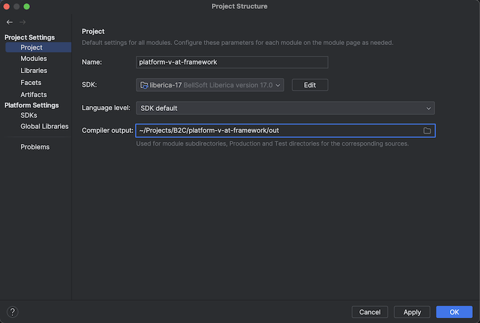
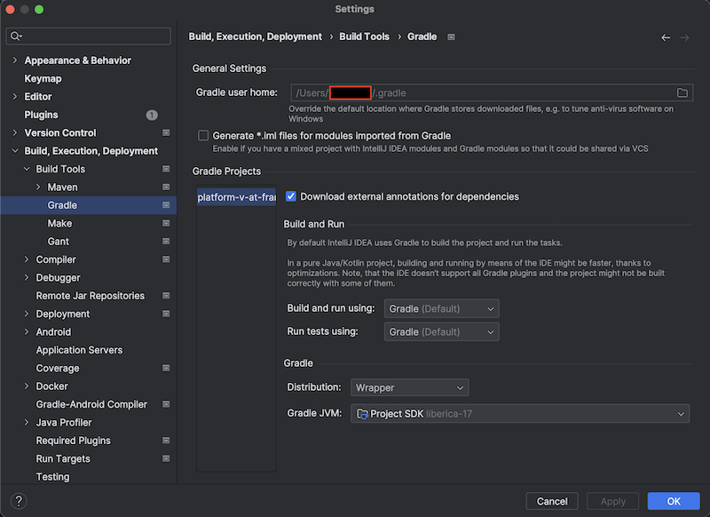

# Шаблон для проекта автотестов

## Нужно ли вам создавать fork от этого проекта?

> Прежде чем создавать отдельный проект с автотестами:
> 
> Если все ваши тесты относятся к конкретному сервису - их лучше писать в том же проекте,
> но в тестовой области.
> 
> - Создайте отдельный пакет.
> - Разделите свои тесты тегами с остальными тестами этого проекта (например, с unit-тестами).
> - Работайте над проектом вместе с вашими разработчиками.
> Пусть они делают ревью ваших тестов, а вы смотрите на то, что делают ваши разработчики.

## Настройка Gradle и сборка проекта
Открываем в IDE проект:
- Устанавливаем в настройках проекта SDK из SberUserSoft:
  - SDK: `Eclipse Temurin JDK 17`  или `Liberica-17`(для MacOs рекомендуется SberJDK 17)
  - Language level: `SDK default`

  

- Проверяем настройки сборщика:
  - Build and Run using: `Gradle`
  - Run tests using: `Gradle`
  - Gradle JVM: `Project SDK`

  

- Настраиваем доступ к репозиториям:
  Для работы Gradle необходимо прописать 3 настройки.
  Все эти настройки находятся в файле `/Users/<username>/.gradle/gradle.properties`

  Содержимое файла:
  ```properties
  systemProp.javax.net.ssl.trustStore=/Users/<имя_пользователя>/.gradle/cacerts
  systemProp.javax.net.ssl.trustStorePassword=<пароль_от_хранилища>

  systemProp.gradle.wrapperUser=<sigma_логин>
  systemProp.gradle.wrapperPassword=<sigma_пароль>

  tokenName=<имя_токена_нексус>
  tokenPassword=<токен_нексус>
  ```
  - `systemProp.gradle.wrapperUser` - ваша sigma-учетка
  - `systemProp.gradle.wrapperPassword` - пароль от вашей sigma-учетки
  - `tokenName` - имя токена, который вы получаете в личном кабинете Nexus
  - `tokenPassword` - токен, который вы получаете в личном кабинете Nexus
  - `systemProp.javax.net.ssl.trustStore` - путь к **файлу** `cacerts` в котором содержатся
    сертификаты (хранилище сертификатов) для доступа к репозиториям (те же, что используются Maven)
  - `systemProp.javax.net.ssl.trustStorePassword` - пароль от хранилища сертификатов, указанный
    при создании этого хранилища

  Если у вас нет этого файла, то его необходимо создать:
  - Скачать сертификаты (
    например, [отсюда](https://mapp.sberbank.ru/sberinfra/rlm/tls-documents/5101488184)):
    - Нужные сертификаты лежат в разделе Тестовый контур
    - Скачать корневой SberCaRootExt [сертификат](http://sberca-proxy-dfpd.sigma.sbrf.ru/sberca/aia/sberca-test-root-ext.crt)
    - Скачать промежуточный SberCaExtG2 [сертификат](http://sberca-proxy-dfpd.sigma.sbrf.ru/sberca/aia/sberca-test-ext-g2.crt)
    - Скачать выпускающий SberCaExt [сертификат](http://sberca-proxy-dfpd.sigma.sbrf.ru/sberca/aia/sberca-test-ext.crt)
  - Перейти в директорию `/Users/<username>/.gradle/gradle.properties`
  - Выполнить команды, заменив **_путь к файлу_** с сертификатом и **_пароль_** на свои значения:
      ```Bash
      keytool -import -trustcacerts -alias SberCaRootExt -file путь_до_sberca-root-ext.crt -keystore cacerts -storepass пароль_от_хранилища
      keytool -import -trustcacerts -alias SberCaExtG2 -file путь_до_sberca-ext-g2.crt -keystore cacerts -storepass пароль_от_хранилища
      keytool -import -trustcacerts -alias SberCaExt -file путь_до_sberca-ext.crt -keystore cacerts -storepass пароль_от_хранилища
      ```
    На вопросы про добавление сертификатов ответить yes.
    В вашей директории появится файл cacerts.
    Актуализируйте значения для:
    - `systemProp.javax.net.ssl.trustStore`.
    - `systemProp.javax.net.ssl.trustStorePassword`
      Попробуйте собрать проект, выполнив команду из директории-корня проекта:
  ```Bash
  ./gradlew clean build -x test
  ```

  Типичные ошибки при сборке:
- 401 при скачивании зависимостей из репозитория  
  Причин может быть несколько:
1. Неверно пропатченный `cacerts`.  
   Попробуйте пропатчить заново.
2. Неверно указанные данные в gradle.properties.   
   Проверьте, нет ли опечатки во введенных данных, не заблокирована ли ваша УЗ, не просрочен ли токен Nexus.
   Также попробуйте зайти в Nexus через UI, чтобы проверить есть ли у вас туда доступ.
3. Если вы пользуетесь MacOs, то скачивайте SberJDK 17


## Настройка Core-функционала проекта

## Настройка Core-функционала проекта

1. [Структура проекта](https://sc-ci.sber.ru/sc/QA/platform-v-at-framework/src/branch/master/docs/project-structure.md)
2. [Что такое Service?](https://sc-ci.sber.ru/sc/QA/platform-v-at-framework/src/branch/master/docs/service.md)
3. [Работа с Environment](https://sc-ci.sber.ru/sc/QA/platform-v-at-framework/src/branch/master/docs/environment.md)
4. [Как работает Flow и ConfigurationService (проперти и шифрование)](https://sc-ci.sber.ru/sc/QA/platform-v-at-framework/src/branch/master/docs/core.md)
   Пример с шифрованием и дешифрованием в классе `EncryptionTest`
5. [Сервис для работы с Fixtures](https://sc-ci.sber.ru/sc/QA/platform-v-at-framework/src/branch/master/docs/services/fixtureService.md)
6. [Сервис для работы с Таймаутами](https://sc-ci.sber.ru/sc/QA/platform-v-at-framework/src/branch/master/docs/services/timeoutService.md)
7. [ValueService](https://sc-ci.sber.ru/sc/QA/platform-v-at-framework/src/branch/master/docs/services/valueService.md)
8. [Работа с Rest API](https://sc-ci.sber.ru/sc/QA/platform-v-at-framework/src/branch/master/docs/services/restService.md)  
   В примерах тестов в классе `RestTest` расположены примеры использования stash(),
   SSlConfiguration(запросы с сертификатами), подробное описание шагов и работы мэтчеров, шифрования и тд.
9. [Работа с Kafka](https://sc-ci.sber.ru/sc/QA/platform-v-at-framework/src/branch/master/docs/services/kafkaService.md)
10. [Работа с Базами Данных](https://sc-ci.sber.ru/sc/QA/platform-v-at-framework/src/branch/master/docs/services/dataBaseService.md)
11. [Работа с СУП-Параметрами](https://sc-ci.sber.ru/sc/QA/platform-v-at-framework/src/branch/master/docs/services/pacmanService.md)
12. [Работа с SberMock](https://sc-ci.sber.ru/sc/QA/platform-v-at-framework/src/branch/master/docs/services/sberMockService.md)
13. [Работа с gRPC](https://sc-ci.sber.ru/sc/QA/platform-v-at-framework/src/branch/master/docs/services/grpcService.md)
14. [Работа с Сессиями](https://sc-ci.sber.ru/sc/QA/platform-v-at-framework/src/branch/master/docs/services/session.md)
15. [Работа с Единым Аудитом](https://sc-ci.sber.ru/sc/QA/platform-v-at-framework/src/branch/master/docs/services/auditService.md)
15. [Matchers and Conditions](https://sc-ci.sber.ru/sc/QA/platform-v-at-framework/src/branch/master/Matchers%26Conditions.md)
16. [Работа с Openshift/Kubernetes](https://sc-ci.sber.ru/sc/QA/platform-v-at-framework/src/branch/master/docs/services/containerService.md)
17. [Подключение проектов с Cucumber](https://sc-ci.sber.ru/sc/QA/platform-v-at-framework/src/branch/master/docs/environment-cucumber7.md)
18. [Работа с TestNG](https://sc-ci.sber.ru/sc/QA/platform-v-at-framework/src/branch/master/docs/environment-testng.md)
19. [Разметка автотестов(Allure-Annotations)](https://sc-ci.sber.ru/QA/allure-annotations/browse)
20. [Работа с GraphQL](https://sc-ci.sber.ru/sc/QA/platform-v-at-framework/src/branch/master/docs/services/qraphql.md)

## Allure-отчеты
Предварительные настройки Allure уже выполнены. Просто выполните команду allureServe

## Централизованное хранение настроек

## Запуск тестов

### Многопоточность

### Запуск по тегам

### Запуск тестов в определенном порядке

### Формирование Test Suite


## Настройка ЕФС-функционала проекта

## Allure-отчеты
Предварительные настройки Allure уже выполнены. Просто выполните команду allure:serve

## Централизованное хранение настроек

## Запуск тестов

### Многопоточность

### Запуск по тегам

### Запуск тестов в определенном порядке

### Формирование Test Suite


